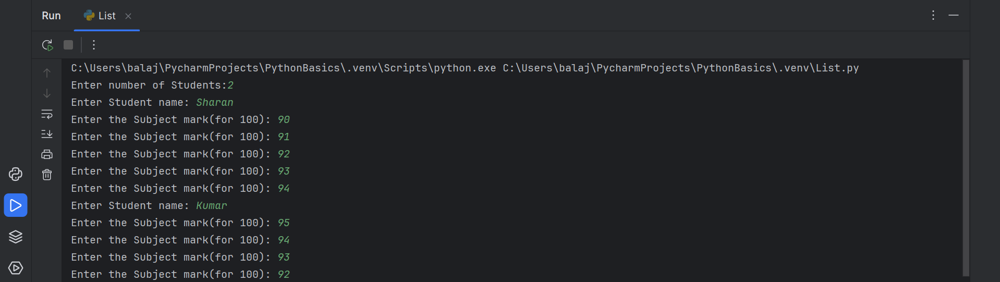
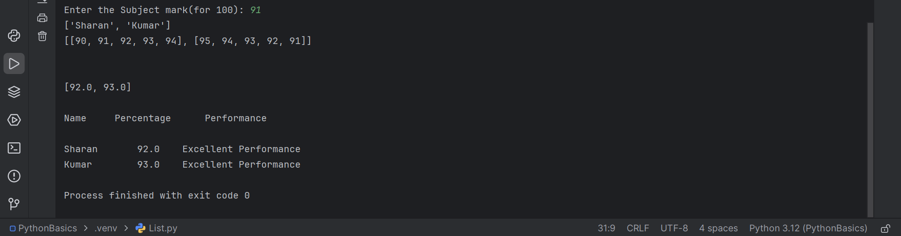

# Python
This repository contains a collection of foundational Python programs and concepts I explored during my postgraduate studies. It covers essential programming topics, data structures and libraries with examples for each concept. Programs included are:

Data Structures: Working with Lists, Tuples, Dictionaries and Sets

Mathematical and Pattern Problems: Fibonacci sequence, Pyramid patterns

File Handling: Reading Excel and CSV files, EB Bill Calculation using CSV

OOP Concepts: Classes and Functions, Inheritance, Abstract Classes

Data Visualization: Matplotlib basics

Libraries: Using Pandas for CSV data, Numpy for numerical operations

Error Handling: Exception Handling

Mini Project(Console Application): ATM Interface

Screenshots:-

List Program : Student Mark Percentage and Performance Calculation

