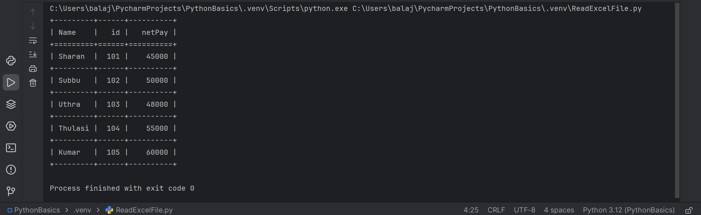

# Python
This repository contains a collection of foundational Python programs and concepts I explored during my postgraduate studies. It covers essential programming topics, data structures and libraries with examples for each concept. Programs included are:

Data Structures: Working with Lists, Tuples, Dictionaries and Sets

Mathematical and Pattern Problems: Fibonacci sequence, Pyramid patterns

File Handling: Reading Excel and CSV files, EB Bill Calculation using CSV

OOP Concepts: Classes and Functions, Inheritance, Abstract Classes

Data Visualization: Matplotlib basics

Libraries: Using Pandas for CSV data, Numpy for numerical operations

Error Handling: Exception Handling

Mini Project(Console Application): ATM Interface

Screenshots:-

1) List Program : Student Semester Mark Percentage and Performance Calculation

2) Tuple Program : Student Internal Mark Calculation

3) Dictionary Program : Student Rank Calculation

4) Set Program : Finding Highest and Least Occurance of digit in a SET

5) Fibonacci, Pyramid, Repeat a and B values Program : Finding Fibonacci, Drawing Pyramid and repeat the values of a and b variable

6) Reading Excel file Program : Displaying Salary details in tabuar faormat by reading excel file

7) EB-Bill Calculation Program : Calculating EB-Bill by reading data in CSV file and display it in tabular format

8) ATM Interface Program : Created ATM Interface using Classes and Function

9) Calculating Area of Rectangle,Square,Triangle Program : Implemented Using Inheritance

10) Ploting Program : Creating Line Plot and Bar Plot(Vertical and Horizontal) by Height and Weight Using Matplotlib library 

10) Exception Handling Program : Implemented using try & except 

